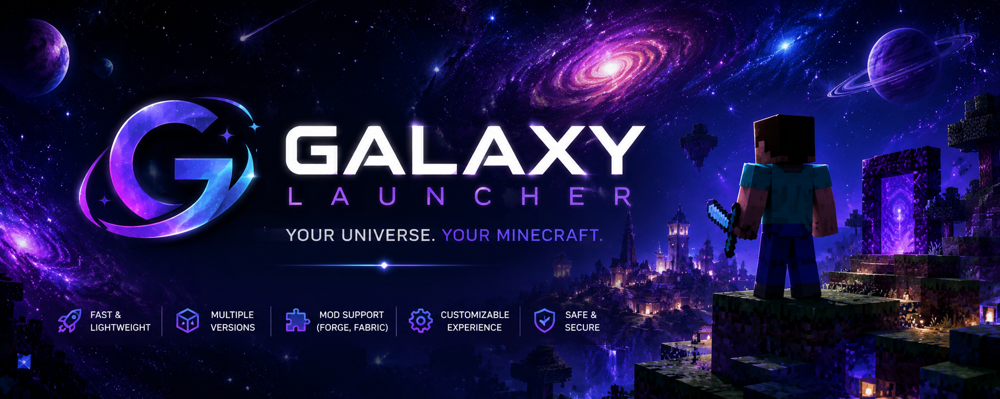
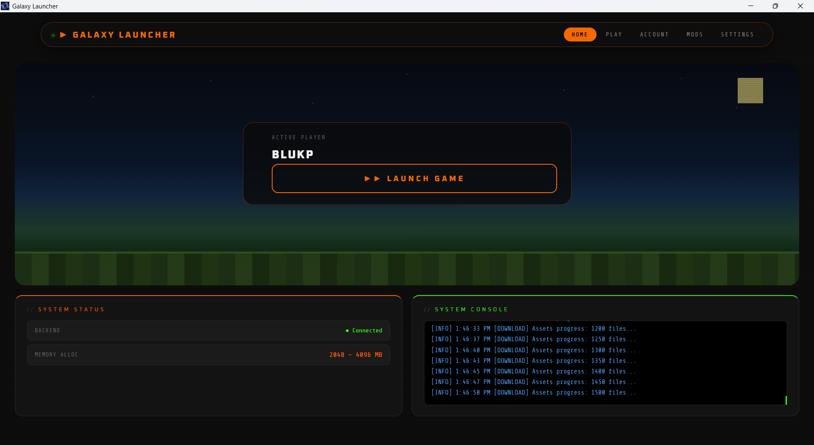
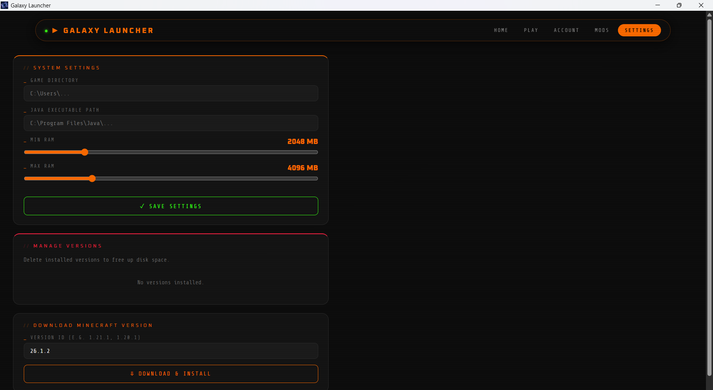

# 🌌 Galaxy Launcher

A modern, lightweight, and powerful Minecraft launcher built for players who want speed, simplicity, and customization.



## ✨ Features

- 🚀 Fast and lightweight performance
- 🔄 Automatic launcher updates
- 📦 Minecraft version management
- 🎮 Easy game launching
- 💾 Custom memory allocation
- 🛠️ Forge, Fabric, and Vanilla support
- 🎨 Modern Galaxy-themed interface
- 📂 Custom game directory support
- 🔧 Java detection and management
- 📜 Detailed launch logs

## 📸 Screenshots

### Main Launcher


### Settings


## 📥 Download

Download the latest release from the **Releases** page:

https://github.com/YOUR_USERNAME/GalaxyLauncher/releases

## ⚙️ Installation

1. Download the latest version.
2. Extract the ZIP file.
3. Run `GalaxyLauncher.exe`.
4. Select your Minecraft version.
5. Click **Play**.

## 🖥️ System Requirements

### Minimum
- Windows 10/11
- 4 GB RAM
- Java 17+

### Recommended
- Windows 11
- 8 GB RAM
- Java 21
- SSD Storage

## 🔄 Auto Updater

Galaxy Launcher automatically checks for updates on startup and downloads new versions when available.

## 🛠️ Development

### Built With

- Electron
- Node.js
- HTML/CSS/JavaScript

### Clone Repository

```bash
git clone https://github.com/YOUR_USERNAME/GalaxyLauncher.git
cd GalaxyLauncher
npm install
npm start
```

## 📁 Project Structure

```
GalaxyLauncher/
├── launcher/
│   ├── src/
│   │   ├── ui/
│   │   ├── core/
│   │   └── services/
│   ├── assets/
│   └── package.json
├── website/
└── README.md
```

## 🎯 Roadmap

- [x] Basic launcher
- [x] Auto updater
- [ ] Microsoft account login
- [ ] Mod manager
- [ ] Modpack support
- [ ] Skin manager
- [ ] Discord Rich Presence
- [ ] Multi-language support

## 🤝 Contributing

Contributions, issues, and feature requests are welcome.

1. Fork the project
2. Create your feature branch
3. Commit your changes
4. Open a Pull Request

## 📜 License

This project is licensed under the MIT License.

## 🌟 Support

If you like Galaxy Launcher, consider giving the repository a ⭐ on GitHub.

---

Made with ❤️ for the Minecraft community.
